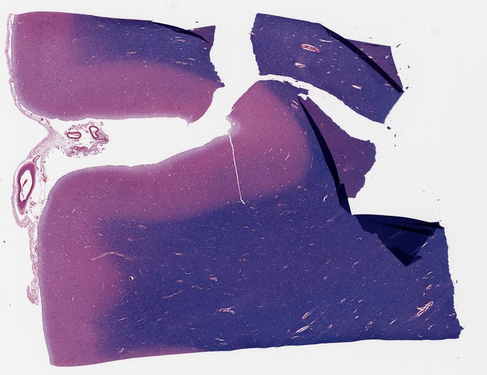
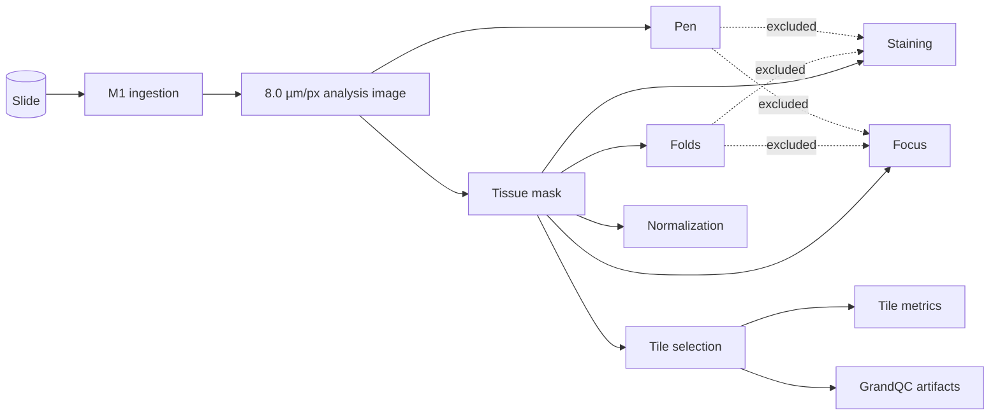
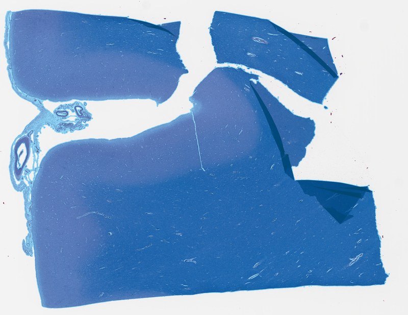
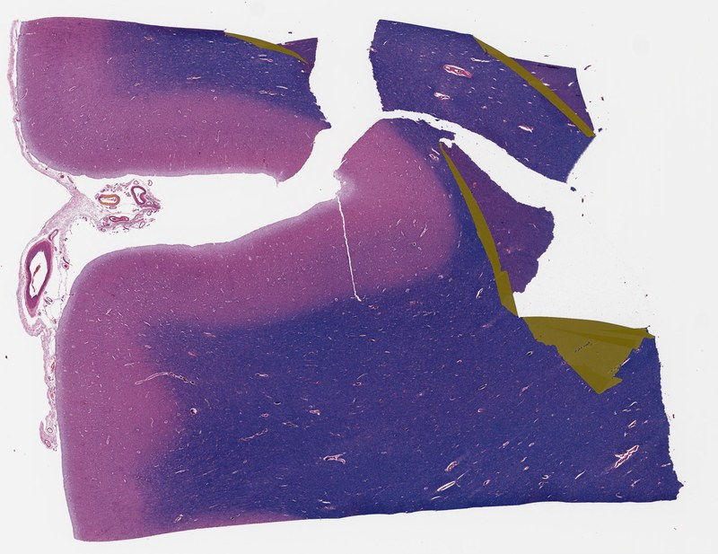
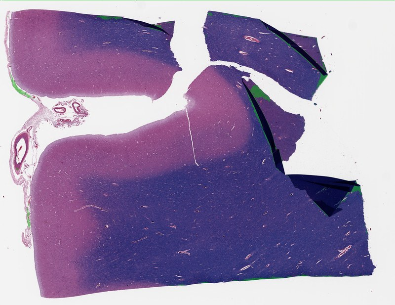
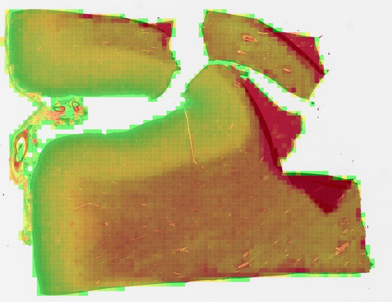
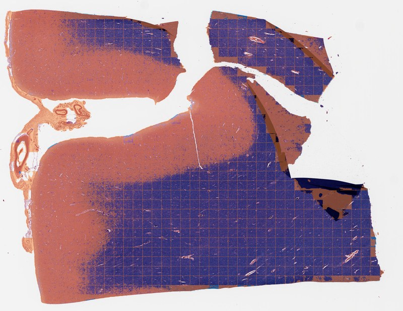
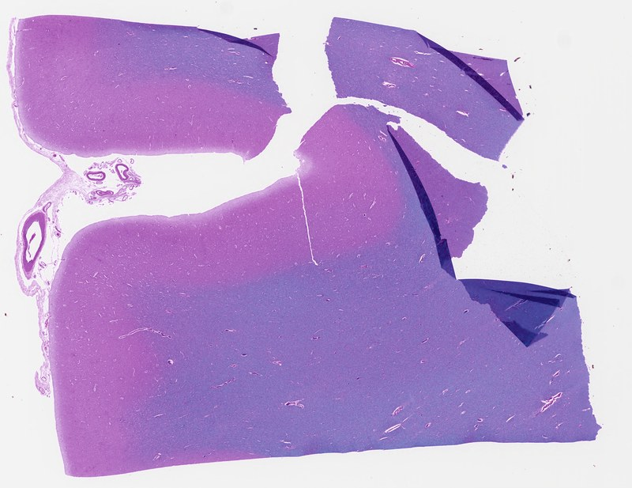
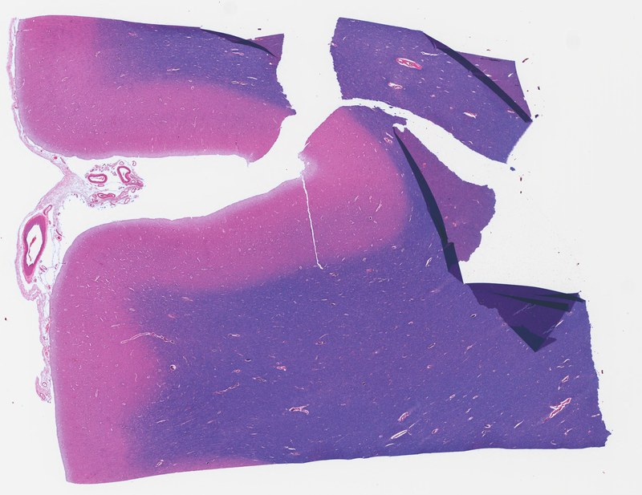

# Path-ND QC user manual

> **Status:** Early beta, for research use only, not validated for clinical use.

This manual walks through Path-ND QC end to end on one real slide: what each step measures, what it
writes, how long it takes and how far to trust it. It is written for people who already know whole-slide
images and neuropathology stains. For every option and edge case, follow the links to the
[reference guides](#reference-guides).

**Contents:** [What the pipeline does](#1-what-the-pipeline-does) ·
[Install](#2-install) · [Run one slide](#3-run-one-slide) · [Read the results](#4-read-the-results) ·
[The components](#5-the-components-one-by-one) · [Run part of the pipeline](#6-run-part-of-the-pipeline) ·
[Batches](#7-batches) · [Configuration and thresholds](#8-configuration-and-thresholds) ·
[Troubleshooting](#9-troubleshooting) · [Before you trust a number](#10-before-you-trust-a-number) ·
[Glossary](#glossary)

## The example slide

Every figure and number below comes from one run of Path-ND QC 0.5.0, with default settings, on
slide **42669**: an LFB/H&E section of frontal cortex from the PART collection, used with permission.

| Property | Value |
|---|---|
| Scanner and file | Aperio `.svs`, 304 MiB, 3 pyramid levels |
| Full size | 42,839 × 33,033 pixels at 0.5066 µm/pixel (20× objective) |
| Why this slide | Four obvious tissue folds along its right-hand edges, which makes it a good test of fold, pen and artifact detection |



## 1. What the pipeline does

Path-ND QC measures the quality of a slide and prepares it for analysis. It works in four stages,
each at a fixed **physical** resolution rather than a magnification label, so slides from different
scanners are measured on the same scale.

| Stage | What it does | Works at |
|---|---|---|
| **M1 ingestion** | Opens the slide, reads its scanner metadata, checks resolution and file integrity | Slide header and a few sampled regions |
| **M2 slide QC** | Tissue, fold and pen masks; staining and focus scores | One whole-slide image at 8.0 µm/pixel (the *analysis image*) |
| **M3 tile QC** | Cuts tissue into 512-pixel tiles, measures each tile, runs GrandQC artifact detection | Tiles at 0.50 µm/pixel; GrandQC at its own model resolution |
| **M4 normalization** | Maps the slide's colours onto a reference for its stain | The 8.0 µm/pixel analysis image |

The nine analysis **components**, and what each one needs:

| Component | Measures or makes | Needs |
|---|---|---|
| `tissue_segmentation` | Tissue mask and tissue coverage | Analysis image |
| `fold_detection` | Fold mask and fold fraction | Analysis image, tissue mask |
| `pen_detection` | Pen-ink mask and pen fraction | Analysis image, pen model |
| `staining_quality` | Mean colour saturation of tissue | Analysis image, tissue mask |
| `focus` | Whole-slide sharpness score | Analysis image, tissue mask |
| `tile_selection` | Tile positions over tissue | Tissue mask |
| `tile_metrics` | Tissue fraction and sharpness per tile; blur heatmap | Tissue mask, tile list, the slide |
| `tile_artifacts` | GrandQC fold, pen and bubble labels per tile | Tissue mask, tile list, the slide, GrandQC |
| `stain_normalization` | Colour-normalized analysis image | Analysis image, tissue mask, a stain reference |



Masks are combined in a fixed order. Tissue comes first; folds are found within tissue; where a
computed pen mask overlaps a computed fold mask, the pixel counts as fold. Staining and focus then
measure only tissue that is neither fold nor pen.

## 2. Install

You need Python 3.12 or newer. macOS on Apple Silicon and Linux are tested; native Windows is not.

```bash
python3 -m venv .venv
source .venv/bin/activate
python -m pip install "git+https://github.com/The-10-000-Brains-Project/path-nd-qc-pipeline.git#subdirectory=src"
pathnd-qc --help
```

On CPU-only Linux, install CPU builds of Torch and torchvision afterwards, as described in the
[CLI guide](../src/USAGE_CLI.md#cpu-only-linux-and-windows). Pip does not download any model weights.
The first run that needs the pen model or GrandQC downloads them, checks their checksums and reuses
them afterwards; add `--no_model_download` to forbid that.

## 3. Run one slide

Run every component with default settings:

```bash
pathnd-qc --slide /data/slides/42669.svs --out reports --no_metadata --stain "LFB/H&E"
```

- `--stain` names the slide's actual stain. It changes how tissue and folds are detected and which
  normalization reference is used, so always give the real one.
- `--no_metadata` says you are not supplying a metadata CSV. With `--metadata your.csv`, the stain
  and other fields are read from the matching row instead.

The command prints a short summary and the two paths you need (shortened here):

```text
components: focus, fold_detection, pen_detection, stain_normalization, staining_quality, tile_artifacts, tile_metrics, tile_selection, tissue_segmentation
read: 8.0 um/px from L2 (up x0.9868) -> plane [2713, 2092]
timing: total 769.7s  m1 0.4557 · m2 23.7244 · m3 553.8619 · m4 1.0513
report -> reports/42669_output/2026-10-06_18-49-47_UTC/42669_report.json
browse -> reports/42669_output/2026-10-06_18-49-47_UTC/index.html
```

**How long it takes.** On an Apple M5 Pro Mac (CPU only), slide 42669 took 579 seconds of
processing, plus about 3 minutes the first time to download the pen and GrandQC models:

| Step | Seconds |
|---|---|
| Ingestion checks | 0.5 |
| Whole-slide QC (tissue 1.3, folds 6.3, pen 15.8, staining 0.3, focus 0.03) | 24 |
| Tile metrics, 3,825 tiles | 57 |
| GrandQC artifact detection | 495 |
| Normalization | 1.1 |

GrandQC is about 85% of the run. With it disabled (see [section 8](#8-configuration-and-thresholds)),
the same full run took 78 seconds. Expect different times on other hardware and on larger slides.

Slides in Google Cloud Storage, AWS S3 or Azure work the same way: pass a `gs://`, `s3://` or `az://`
URI to `--slide`. Whole-slide QC streams just the level it needs; tile components download one local
copy first. See [cloud slides](../src/USAGE_CLI.md#cloud-slides-gcs-aws-s3-and-azure) for credentials.

**To try the pipeline without your own data**, use the public SEA-AD slide from the
[demo notebook](../demo.ipynb). It needs no credentials and takes about two minutes for whole-slide QC:

```bash
FSSPEC_S3='{"anon": true}' pathnd-qc \
  --slide 's3://sea-ad-quantitative-neuropathology/middle-temporal-gyrus/H19.33.004/H19.33.004-A06-NEUN/H19.33.004-A06-NEUN.svs' \
  --out reports --run_thumbnail --no_metadata --stain NeuN
```

## 4. Read the results

Each run gets its own dated folder, so repeated runs never overwrite each other:

```text
reports/
└── 42669_output/
    ├── slide.json                       # which source file this folder belongs to
    └── 2026-10-06_18-49-47_UTC/
        ├── index.html                   # open this first: links, status, version
        ├── 42669_report.json            # every measurement, setting and execution detail
        ├── 42669_status.json            # running, completed or failed
        ├── images/
        │   ├── 42669_tissue_mask.png    # masks at the 8.0 µm/px analysis resolution
        │   ├── 42669_fold_mask.png
        │   ├── 42669_pen_mask.png
        │   ├── 42669_tissue_mask_20x.tif   # tissue mask at the 0.50 µm/px tile resolution
        │   ├── 42669_blur_overlay.png
        │   ├── 42669_artifact_overlay.png
        │   └── 42669_normalized.png
        └── data/
            ├── 42669_tile_list.json     # tile positions
            └── 42669_tile_records.json  # per-tile tissue fraction, focus, kept or dropped
```

### Did the run work?

Check these three report fields first:

| Field | Slide 42669 | Meaning |
|---|---|---|
| `error` | `null` | No run-level failure |
| `provenance.execution.complete` | `true` | Every requested component finished |
| `provenance.execution.reasons` | `[]` | Nothing was skipped or incomplete |

If a selected component fails, the run is marked failed (status `failed`, exit code 1), but every
measurement that did finish is kept in the report. `provenance.components_failed` names the
component, and its section's `error` field says why.

### Did the slide pass?

**Path-ND QC does not decide that on its own.** A completed run means the processing finished, not
that the slide is good. Pass/fail comes from the `verdict` section, which compares measurements with
thresholds you set. All thresholds ship unset, so out of the box the verdict is:

```json
{"passed": null, "flags": [], "n_thresholds_checked": 0}
```

[Section 8](#8-configuration-and-thresholds) shows how to set thresholds. Choose them for your stain
and purpose; there are no validated defaults yet.

### Where the measurements are

| Report section | Slide 42669 |
|---|---|
| `m1.ingestion.checks` | Magnification, resolution and integrity checks all passed |
| `m2.tissue.tissue_coverage_score` | 0.637 (64% of the analysis image is tissue) |
| `m2.folds.fold_area_fraction` | 0.0327 (3.3% of tissue) |
| `m2.pen.pen_area_fraction` | 0.0088 (0.9% of the image; all false positive, see below) |
| `m2.staining.staining_quality_score` | 38.5 |
| `m2.focus.focus_score` | 1,235 |
| `m3.tiles` | 3,825 tiles selected, 3,606 kept (94.3%); median tile focus 499 |
| `m3.artifacts` | Backend, model resolution and flag counts (0 here; see below) |
| `m4.stain_norm` | Method `macenko`, reference `H21.33.042-A2-LFB` (a placeholder) |
| `provenance` | Pipeline version, git commit, configuration hash, model hashes |

`null` always means "no value", never zero. The report also records the code revision
(`provenance.git_commit`), whether the code was modified (`git_dirty`) and a hash of the resolved
settings (`config_sha256`), so you can tell exactly what produced a number. For every field, see
[reading a report](../src/USAGE_CLI.md#9-reading-a-report).

## 5. The components, one by one

Each subsection shows what the component did on slide 42669, how to run it alone, and its main
limits. The linked guides have the full method and all settings.

### Tissue segmentation

Separates tissue from glass. By default it combines two methods: an Otsu threshold (tissue is more
saturated or darker than glass) and a local-texture measure (tissue is textured, glass is flat).
Hirano slides use a saturation-only method instead.



- **42669:** 63.7% of the image is tissue. The mask follows the section outline and excludes glass
  and the tear between the upper pieces.
- **Run alone:** `--run_tissue_segmentation`. Needs no model.
- **Limits:** coverage alone cannot show whether the mask follows the true tissue edge, and dirty or
  very pale backgrounds can be over-segmented. Look at the mask.
- **Guide:** [tissue](../src/pathnd_qc/qc_slide/tissue/README.md)

### Fold detection

Finds folded tissue: doubled-over regions that look darker and more saturated. Two detectors are
combined. **ConnSoftT** finds fold bodies, using saturation minus brightness on LFB, LFB/H&E and
Hirano slides, and the second stain channel on other stains. **F_line** finds thin, line-shaped folds.



- **42669:** 3.3% of tissue is fold (ConnSoftT 3.2%, F_line 0.9%, partly overlapping). All four
  folds along the right-hand edges are marked.
- **Run alone:** `--run_fold_detection`, together with `--run_tissue_segmentation` or a saved
  `--tissue_mask`.
- **Limits:** thresholds were tuned on about a dozen slides. The guide shows examples of a missed
  fold and of a false positive on uniform tissue.
- **Guide:** [folds](../src/pathnd_qc/qc_slide/folds/README.md)

### Pen detection

Finds pen and marker ink with a neural network (the WSISegQC model) run on the analysis image, so
ink can be excluded from staining and focus.



- **42669 has no pen marks, so everything marked here is a false positive.** The model first
  marked 2.8% of the image, mostly the dark edges of the folds; 1.9% of that overlapped the fold mask
  and was given to folds, leaving 0.9%. The faint green line around the image border is a known
  artifact of how the image is padded for the model.
- **Run alone:** `--run_pen_detection`. Downloads the pen model on first use.
- **Limits:** detection of real ink has not been confirmed on this collection. Expect false
  positives on folds and borders; treat the mask as an unvalidated prediction.
- **Guide:** [pen](../src/pathnd_qc/qc_slide/pen/README.md)

### Staining quality

The mean colourfulness (CIE-Lab chroma) of tissue, excluding folds and pen.

- **42669:** 38.5.
- **Run alone:** `--run_staining_quality` with a tissue mask.
- **Limits:** the score depends mostly on the stain. Typical values range from about 4 for NeuN or
  AT8 to about 40 for H&E or LFB/H&E, so **only compare slides of the same stain**. Over- and
  under-stained regions can average out, so a patchy slide can score as normal.
- **Guide:** [staining](../src/pathnd_qc/qc_slide/staining/README.md)

### Focus

A whole-slide sharpness score: the variance of the image's second derivative (Laplacian) over tissue
that is neither fold nor pen.

- **42669:** 1,235.
- **Run alone:** `--run_focus` with a tissue mask.
- **Limits:** at 8.0 µm/pixel this measures texture and stain contrast as much as scanner focus.
  For focus problems, use the per-tile focus from [tile metrics](#tile-selection-and-tile-metrics),
  which works at 0.50 µm/pixel.
- **Guide:** [focus](../src/pathnd_qc/qc_slide/focus/README.md)

### Tile selection and tile metrics

Tile selection lays a grid of 512 × 512 tiles at 0.50 µm/pixel over the slide and keeps every tile
that touches tissue. Tile metrics then reads each tile at full resolution, drops tiles that are
less than 20% tissue, and measures the focus of the rest.


- **42669:** 3,825 tiles selected and 3,606 kept (94.3%). 143 were dropped before reading, using the
  coarse mask, and 76 after re-checking at full resolution. Median tile focus is 499 (5th–95th
  percentile 114–1,035).



- **Reading the heatmap:** green tiles are sharper and red tiles are blurrier **or simply have
  little texture**. On 42669 the reddest tiles are the folds and smooth white matter, not
  out-of-focus regions. Colours are relative measurements, not validated blur labels.
- **Run alone:** `--run_tissue_segmentation --run_tile_selection --run_tile_metrics`. Reads the slide
  at full resolution; cloud slides are downloaded first.
- **Resolution gate:** tile QC is skipped for slides coarser than 0.55 µm/pixel (for example, 10×
  scans). Whole-slide QC and normalization still run.
- **Guides:** [tiles](../src/pathnd_qc/qc_tile/tiles/README.md) ·
  [tile metrics](../src/pathnd_qc/qc_tile/tile_metrics/README.md)

### Tile artifacts (GrandQC)

Runs the published [GrandQC](https://github.com/cpath-ukk/grandqc) artifact model over the whole
slide and reports, for each tile, how much is fold, pen or air bubble.



Overlay colours: **red** fold · **purple** dark spot · **blue** pen · **orange** air bubble ·
**yellow** out of focus. Tissue and background are not tinted.

- **42669: GrandQC labels about half of the tissue as air bubble (orange) and marks none of the four
  folds.** GrandQC was trained on cancer histology, and this result shows it does not transfer
  reliably to neuropathology stains. Do not use its labels without checking them against the slide.
- **What the report contains:** with default settings, `m3.artifacts` records only how many tiles
  were *flagged* per class, and nothing is flagged until you set `m3.artifacts.min_fraction`. The
  overlay is the main output. Per-tile fractions are available through the
  [Python API](../src/USAGE_LIBRARY.md).
- **Cost:** about 8 minutes on 42669, most of a full run.
- **Run alone:** `--run_tissue_segmentation --run_tile_selection --run_tile_artifacts`. To leave it
  out of every run, disable it in configuration (see [section 8](#8-configuration-and-thresholds)).
- **License:** GrandQC is distributed under a non-commercial license (CC BY-NC-SA 4.0), and use is
  subject to the terms of the original GrandQC license. See the
  [third-party notices](../src/THIRD_PARTY_NOTICES.md).
- **Guide:** [artifacts](../src/pathnd_qc/qc_tile/artifacts/README.md)

### Stain normalization

Maps the slide's colours onto a reference for its stain class, changing only tissue pixels.
**Macenko** (the default) matches the two stain colours and their strength; **Reinhard** matches
colour averages and spread.

| Reference (LFB-HE) | Macenko (default) | Reinhard |
|---|---|---|
|  |  |  |

- **42669:** both methods map the slide onto the shipped LFB-HE reference, an SEA-AD slide. Macenko
  pulls the pink grey matter and blue white matter towards the same violet, so their contrast is
  largely lost. Reinhard keeps them distinct. For LFB-based stains, consider `--norm_method reinhard`.
- **The shipped references are placeholders.** They demonstrate the method; they are not validated
  targets, and this one was fitted at 16 µm/pixel rather than 8. Fit your own before relying on
  normalized images; the [normalization guide](../src/pathnd_qc/normalization/README.md#create-a-reference-configuration)
  includes a script.
- **Run alone:** `--run_tissue_segmentation --run_stain_normalization`. Normalization is not part of
  `--run_thumbnail` or `--run_tiles`, so it always needs its own flag in a partial run.

Reference image credit: Allen Institute, SEA-AD — https://registry.opendata.aws/allen-sea-ad-atlas/;
see [third-party notices](../src/THIRD_PARTY_NOTICES.md).

## 6. Run part of the pipeline

With no `--run_*` flags, every enabled component runs. Name components to run only those:

```bash
# Whole-slide QC only: tissue, folds, pen, staining, focus (26 seconds on 42669)
pathnd-qc --slide /data/slides/42669.svs --out reports --run_thumbnail --no_metadata --stain "LFB/H&E"

# Tissue and tile measurements, without GrandQC (58 seconds on 42669)
pathnd-qc --slide /data/slides/42669.svs --out reports \
  --run_tissue_segmentation --run_tile_selection --run_tile_metrics --no_metadata --stain "LFB/H&E"
```

| Group flag | Selects |
|---|---|
| `--run_thumbnail` | Tissue, folds, pen, staining, focus |
| `--run_tiles` | Tile selection, tile metrics, tile artifacts (not tissue: add `--run_tissue_segmentation`) |

**Components do not pull in what they need.** If you select fold detection, also select tissue
segmentation or supply a saved tissue mask. You can reuse outputs from an earlier run of the same
slide:

```bash
pathnd-qc --slide /data/slides/42669.svs --out reports --run_fold_detection \
  --tissue_mask reports/42669_output/2026-10-06_18-49-47_UTC/images/42669_tissue_mask.png \
  --no_metadata --stain "LFB/H&E"
```

The reusable inputs are `--tissue_mask`, `--fold_mask`, `--pen_mask`, `--tile_list` and
`--thumbnail` (the analysis image). Masks must come from the same slide. For formats and
precedence rules, see [reusing masks](../src/USAGE_CLI.md#5-reusing-masks-and-tile-lists).
`pathnd-qc --list_components` prints every component with its inputs and outputs.

## 7. Batches

Process a folder of slides, two at a time, in a named batch you can resume:

```bash
pathnd-qc-batch run --slide_dir /data/slides --out reports --batch_id study01 --workers 2 \
  --run_thumbnail --no_metadata --stain "LFB/H&E"
```

- **Resume:** repeat the same command with the same `--out` and `--batch_id`. Completed slides are
  skipped; add `--retry_failed` to retry failures or `--force` to redo everything.
- **Mixed stains:** use a CSV manifest with a `slide` column and a `stain` column, passed as
  `--slides manifest.csv`. A text file with one slide path or cloud URI per line also works.
- **Preview first:** `pathnd-qc-batch list` with the same options shows the jobs without running them.
- **Results:** `reports/batch_study01/index.html` links every slide; `summary.csv` has one row of
  measurements per slide, ready for a spreadsheet.
- **Resources:** each worker processes one slide, so memory and disk scale with `--workers`. Start
  with one or two.

See the [batch guide](../src/pathnd_qc/batch/README.md) for manifests, second passes that reuse
masks, and output layout.

## 8. Configuration and thresholds

Settings are changed with a JSON file named by the `PATHND_CONFIG` environment variable. The file
only needs the keys you change. For example, to leave GrandQC out of every run and set some QC
thresholds:

```json
{
  "components": {"tile_artifacts": false},
  "thresholds": {
    "m2.folds.fold_area_fraction": {"max": 0.05},
    "m3.tiles.kept_fraction": {"min": 0.8},
    "m2.staining.staining_quality_score": {
      "by_stain": {"LFB-HE": {"min": 25, "max": 50}}
    }
  }
}
```

```bash
PATHND_CONFIG="$PWD/my_settings.json" pathnd-qc --slide /data/slides/42669.svs --out reports \
  --no_metadata --stain "LFB/H&E"
```

- **Thresholds flag; they do not reject.** Out-of-range values appear in `verdict.flags` and set
  `verdict.passed` to `false`. Nothing is deleted or skipped.
- **Only set thresholds for metrics the run measures.** A threshold on a metric that was not
  computed, such as `m3.tiles.kept_fraction` in a `--run_thumbnail` run, is flagged as
  "metric not present" and makes `verdict.passed` false.
- **Use per-stain bounds** (`by_stain`) for staining and other stain-dependent scores.
- **The numbers above are an illustration, not a recommendation.** Choose bounds from your own
  slides.
- Batch runs and the Verily workflows use the same settings file.

The [configuration guide](../src/pathnd_qc/config/README.md) lists every setting, including
normalization references, stain spellings and resolution limits.

## 9. Troubleshooting

| What you see | What to do |
|---|---|
| A component fails because a mask or tile list is missing | Select the component that produces it, or supply it from an earlier run |
| Tile QC is skipped with a resolution message | The slide is coarser than 0.55 µm/pixel; check `m1.ingestion.checks.mpp` |
| A pen or GrandQC setup error | Run `pathnd-qc setup --check`, then `pathnd-qc setup pen` or `pathnd-qc setup grandqc` |
| The pen model download is blocked | Download `pen.pt` in a browser from the [model folder](https://drive.google.com/drive/folders/1P3E9kZDM7A7cM06RR47kywvQCL3X0HJz) and run `pathnd-qc setup pen --weights /path/to/pen.pt` |
| The stain is "not recognized" | Use a known spelling, such as `LFB/H&E`, `HE`, `AT8`, `GFAP`, `NeuN`, `Hirano`, `Beta-Amy` or `ASyn` |
| A resumed batch does no work | Completed slides are skipped; use `--force` to repeat them |
| A batch reruns every slide | The command or settings changed since the first run, so earlier results do not count. This also happens once after a first batch that downloaded the models |

More cases are in the [CLI troubleshooting table](../src/USAGE_CLI.md#11-troubleshooting).

## 10. Before you trust a number

- **Nothing here is validated for clinical use**, and thresholds, references and models have only
  been checked on small sets of research slides.
- **Look at the masks and overlays**, not just the numbers. Slide 42669 shows why: the pen fraction
  is all false positive and GrandQC's labels are mostly wrong.
- **Compare like with like.** Staining and focus scores depend on stain and resolution; compare
  slides of the same stain, scanned the same way.
- **Normalization references are placeholders.** Fit and approve your own before analysing
  normalized images.
- **Record provenance.** Keep the report's commit, configuration hash and model hashes with any
  result you publish.

## Reference guides

| Topic | Guide |
|---|---|
| All command-line options, outputs and report fields | [CLI usage](../src/USAGE_CLI.md) |
| Python scripts and notebooks | [Library usage](../src/USAGE_LIBRARY.md) |
| Running on Verily workflows | [Verily usage](../src/USAGE_VERILY.md) |
| Model downloads and custom models | [Model setup](../src/pathnd_qc/external/README.md) |
| Settings and thresholds | [Configuration](../src/pathnd_qc/config/README.md) |
| Batches | [Batch processing](../src/pathnd_qc/batch/README.md) |
| Each component | [Package overview](../src/pathnd_qc/README.md#guides) |

## Glossary

| Term | Meaning |
|---|---|
| **µm/pixel (MPP)** | Physical size of one pixel. 0.5 µm/pixel is roughly a 20× scan |
| **Analysis image** | The whole slide read at 8.0 µm/pixel; input to whole-slide QC and normalization |
| **M1–M4** | The four stages: ingestion, slide QC, tile QC, normalization |
| **Component** | One of the nine analyses, each switchable on and off |
| **Tile** | A 512 × 512 pixel square at 0.50 µm/pixel (256 µm across) |
| **Chroma** | Colour saturation in CIE-Lab space; the staining score |
| **Laplacian variance** | A sharpness measure: how strongly brightness changes at fine scale |
| **ConnSoftT, F_line** | The two fold detectors: fold bodies and thin line folds |
| **GrandQC** | A published artifact-detection model, trained on cancer histology |
| **Macenko, Reinhard** | Two stain-normalization methods |
| **Placeholder reference** | A shipped normalization target that is not validated |
| **Verdict** | The report section comparing measurements against your thresholds |
