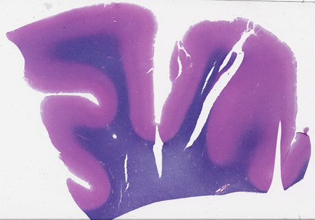
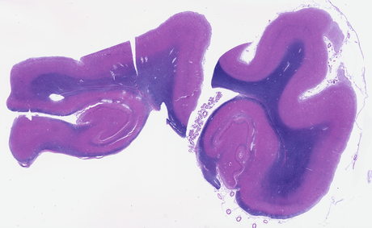
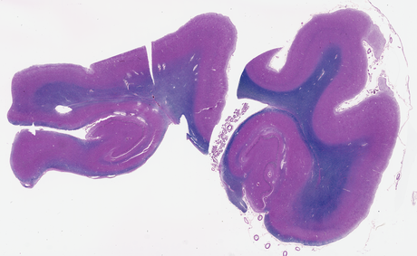
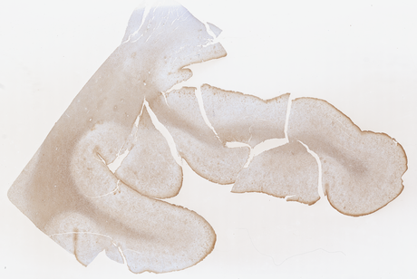
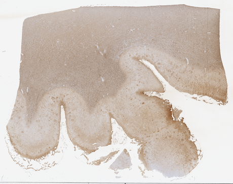
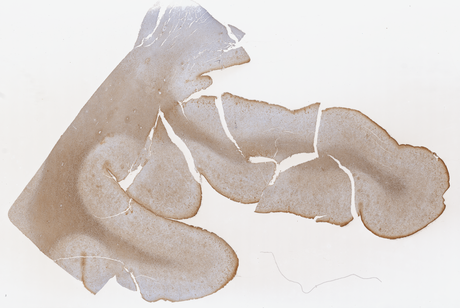
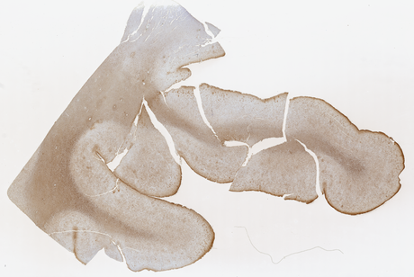

# M4 — Stain Normalization (`stain_norm.py`)

[Package overview](../README.md) · [CLI usage](../../USAGE_CLI.md) · [Library usage](../../USAGE_LIBRARY.md)

[How it works](#how-it-works) · [Usage](#usage) · [Create a reference configuration](#create-a-reference-configuration) · [Defaults](#defaults) · [Historical observations and limitations](#historical-observations-and-limitations) · [Structure](#structure) · [References](#references)

For setup, paths, and output folders, start with the [usage guide](../../USAGE_CLI.md). Command examples below use the activated environment where the package is installed. Replace `/path/to/slide.svs` with your slide and mask paths with files from its earlier run.

Resolutions shown are the shipped defaults; µm/px means micrometres per pixel. Output artifacts are written inside the slide’s timestamped run folder unless `--no_save_artifacts` is used; the report is still written.

Maps a slide's colour onto a reference target for its stain type, to reduce colour differences. This does not establish that biological measurements become comparable;
the shipped targets are placeholders and require validation for the intended use.

**In:** the 8.0 µm/px analysis image, the tissue mask, and a stain type.
**Out:** a normalized image, background left **byte-identical**, plus the parameters used.

| method | family | what it matches |
|---|---|---|
| `macenko` *(default)* | stain deconvolution | the two stain vectors and their concentrations |
| `reinhard` | colour statistics | per-channel mean and standard deviation in LAB |

## How it works

**Source parameters are estimated once per `normalize_slide()` call.** The pipeline applies them to the analysis image only; it does not write normalized tiles.
For a custom tile workflow, call `freeze_slide()` once, then reuse its parameters with `normalize()`
for each tile to avoid fitting a different transform for every tile.

```
load_reference()   once per stain type   ->  target parameters
freeze_slide()     once per slide        ->  source parameters
normalize()        per image             ->  no re-estimation
```

- **Only tissue pixels are used, and that is exact.** No estimator looks at a neighbouring pixel, so a
  bag of masked pixels is mathematically identical to the image with the background deleted. The
  result is scattered back into a copy of the original, leaving the background untouched.
- **References resolve most specific first:** `"<stain>/<bank>"` → `"<stain>"`, each also tried
  through `m4.stain_aliases`, which maps raw metadata spellings onto stain classes (`"LFB/H&E"` →
  `LFB-HE`).

## Usage

```bash
pathnd-qc --slide "/path/to/slide.svs"                                  # M4 runs in a full run
pathnd-qc --slide "/path/to/slide.svs" --run_tissue_segmentation --run_stain_normalization
pathnd-qc --slide "/path/to/slide.svs" --run_stain_normalization --norm_method reinhard \
              --tissue_mask out/slide_tissue_mask.png
```

The Python example is a contextual snippet: create an RGB PIL image named `plane` (or `thumb`)
and the masks/geometry it references first. Check returned error fields before using results.

```python
from pathnd_qc.normalization.stain_norm import stain_norm as sn

target = sn.load_reference("LFB/H&E")["result"]
out    = sn.normalize_slide(plane, target, method="macenko",
                            tissue_mask=tissue["tissue_mask"], stain_type="LFB/H&E")
```

- **Flag:** `--run_stain_normalization`. ⚠️ **M4 is in neither module alias**, so it needs its own flag.
- **Needs a tissue mask** and a resolvable reference for the slide's stain.
- **Uses the shared analysis image.** A remote slide is usually read without full download, but
  the reader may localize it when the selected pyramid level exceeds the configured read-size limit.
- **Writes** `images/<slide_id>_normalized.png`; parameters land at `m4.stain_norm` in `<slide_id>_report.json`.
- `--norm_method macenko|reinhard` and `--bank <name>` override method and bank.

`load_reference(spec=...)` accepts a stain-keyed mapping, or a single entry containing a
`macenko` key. Wrap a Reinhard-only entry in a stain-keyed mapping. Pass already-frozen target
parameters directly to `normalize()`. `slide_record()` / `tile_record()` are standalone
provenance helpers; the pipeline does not call them or write normalized tile images.

For NumPy inputs, use uint8 RGB. Background preservation is relative to the RGB input after
image conversion; it does not preserve an original alpha channel or higher-bit-depth pixels.

## Create a reference configuration

Choose a representative reference slide and stain whose suitability you have assessed for your
analysis. Fit at the same analysis scale used for your slides (8.0 µm/pixel by default), and review
the tissue mask before approving the target. Fitting parameters alone does not validate a reference.

This script reads one reference, fits both supported methods, and writes `references.json`.
Replace the path, stain and reference ID. It leaves `is_placeholder=True`; change that flag to
`False` only after approving the reference and its tissue support.

```python
import json
from pathlib import Path

from pathnd_qc import WSIReader
from pathnd_qc.qc_slide.tissue.tissue import compute_tissue_mask
from pathnd_qc.normalization.stain_norm import stain_norm as sn

reference_path = "/data/references/approved-reference.svs"
stain = "HE"
reference_id = "reference-01"
is_placeholder = True

reader = WSIReader()
with reader.slide(reference_path) as slide:
    image, geometry = reader.read_at_mpp(slide, 8.0)
if image is None:
    raise RuntimeError(f"Reference image could not be read: {geometry}")

tissue = compute_tissue_mask(image, stain_type=stain)
if tissue.get("tissue_error") or tissue.get("tissue_mask") is None:
    raise RuntimeError(f"Reference tissue mask failed: {tissue.get('tissue_error')}")

entry = {
    "reference_slide_id": reference_id,
    "fitted_at_mpp": geometry["achieved_mpp"],
    "is_placeholder": is_placeholder,
}
for method, fields in {
    "macenko": ("stain_matrix", "maxC"),
    "reinhard": ("means", "stds"),
}.items():
    fitted = sn.fit_reference(
        image, tissue_mask=tissue["tissue_mask"], method=method,
        stain_type=stain, reference_slide_id=reference_id,
        is_placeholder=is_placeholder, fitted_at_mpp=geometry["achieved_mpp"],
    )
    if fitted["error"] or fitted["result"] is None:
        raise RuntimeError(f"Reference fitting failed ({method}): {fitted['error']}")
    entry[method] = {name: fitted["result"][name] for name in fields}

settings = {"m4": {"reference": {stain: entry}}}
Path("references.json").write_text(json.dumps(settings, indent=2, allow_nan=False) + "\n")
```

The method entries contain only configuration fields; do not paste the entire `fit_reference()`
result into `m4.reference`. For a bank-specific target, use a key such as `"HE/my-bank"` in place
of `stain`, and select `bank="my-bank"` in Python or `--bank my-bank` in the CLI.
Other stain entries retain their defaults until you replace them too.

Run normalization with this configuration in a fresh process:

```bash
PATHND_CONFIG="/absolute/path/to/references.json" \
  pathnd-qc --slide "/data/slides/example.svs" --out reports --stain "HE" \
  --run_tissue_segmentation --run_stain_normalization
```

For Python, set `os.environ["PATHND_CONFIG"]` before importing pipeline/components, then call
`run(..., components={"tissue_segmentation", "stain_normalization"}, stain_type="HE")`.
Restart an existing notebook kernel before loading changed settings. For Verily, upload
`references.json` and supply it as the WDL File input `PathNDQC.config_file`; set `PathNDQC.stain`
and `PathNDQC.bank` as appropriate. Reference values are embedded in the JSON, so no reference-slide
path needs to be localized by the workflow.

## Defaults

Values live in [`config/defaults.json`](../config/defaults.json). Prefer a separate JSON override file selected with
`PATHND_CONFIG=/path/to/settings.json`; see the [configuration guide](../config/README.md).
Where a Python function accepts an argument, an explicit value overrides its configured default.
Configuration keys are not automatically command-line flags.

| key | default | what it does |
|---|---|---|
| `m4.method` | `"macenko"` | method used when `--norm_method` is not given |
| `m4.methods` | `["macenko", "reinhard"]` | selectable methods; an override can restrict the list |
| `m4.min_tissue_px` | `3` | minimum pixels for Macenko fitting; not applied to Reinhard |
| `m4.angular_percentile` | `99.0` | percentile used to pick stain vectors |
| `m4.od_eps` · `m4.eps` | `1e-06` · `1e-08` | numerical floors |
| `m4.provenance_dir` | `"reports"` | fallback for the standalone `write_provenance()` helper; the pipeline embeds parameters in its report |
| `m4.reference` | 9 stain entries | the target parameters per stain class |
| `m4.stain_aliases` | 15 entries | raw spellings mapped onto stain classes |

**Adding a bank-specific target is a config edit** — add a `"<stain>/<bank>"` key under
`m4.reference` and it wins over the plain `"<stain>"` key.

## Historical observations and limitations

The examples and measurements in this section come from earlier development runs. They have not
been rerun for this documentation update and may use older code or image resolutions. They are not
current benchmarks, accuracy guarantees, or recommended quality thresholds.

| | slide | reference it maps onto | macenko | reinhard |
|---|---|---|---|---|
| **`H21.33.008-A12-LFB`** — SEA-AD, LFB |  |  |  |  |
| **`H20.33.002-A6-GFAP`** — SEA-AD, GFAP (DAB) |  |  |  |  |

Image credit: Allen Institute, SEA-AD — https://registry.opendata.aws/allen-sea-ad-atlas/; see
[third-party notices](../../THIRD_PARTY_NOTICES.md).

References used: `H21.33.042-A2-LFB` for LFB and `H20.33.013-A1-GFAP` for GFAP — each recorded in
the report as `reference_slide_id`.

- **Cost: 2.6 s and 3.8 s for macenko, 0.8 s and 1.3 s for reinhard** on those two slides — under
  0.5 % of a full run.
- **Ran on 161 slides across 9 stain classes, 161 of 161 succeeding.**
- **Macenko over-purples `LFB-HE`**, visible above — the blue myelin and pink cortex collapse toward
  violet. Reinhard keeps them separable. The two DAB stains, which are genuine two-dye systems, come
  through without that failure.
- ⚠️ **The reference targets are placeholders.** Every entry carries `is_placeholder: true` and was
  fitted at **3.69–16.16 µm/px**, not the 8.0 the pipeline analyses at. Both flags ride into every
  report.
- **The implementation marks `Hirano`, `LFB-HE`, and `HE` with `not_two_dye` notes** for its
  current dataset assumptions. This is a code-level caution, not a claim that all H&E material
  universally violates a two-stain model. Review the note and reference suitability for your data.
- **Vahadane is not implemented.** The CLI accepts only `macenko` and `reinhard`. Direct public
  normalization helpers return an `error` when Vahadane is requested; the implementation records
  instability observed in earlier experiments as the reason.

## Structure

```
normalization/
├── README.md                     ← you are here
├── assets/
└── stain_norm/
    └── stain_norm.py             Macenko and Reinhard, slide-level frozen parameters
```

## References

- Macenko et al., "A method for normalizing histology slides for quantitative analysis," *ISBI* 2009.
- Reinhard et al., "Color transfer between images," *IEEE CG&A* 2001.
- Vahadane et al., "Structure-preserving color normalization…," *IEEE TMI* 35(8) 2016 — not implemented.
- TIAToolbox — [github.com/TissueImageAnalytics/tiatoolbox](https://github.com/TissueImageAnalytics/tiatoolbox), the source the maths was transcribed from.
