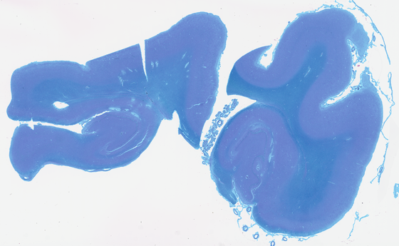
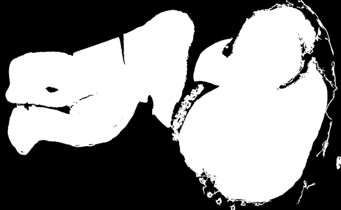

# Tissue Segmentation (`tissue.py`)

[Package overview](../../README.md) · [CLI usage](../../../USAGE_CLI.md) · [Library usage](../../../USAGE_LIBRARY.md) · [Parent module](../README.md)

[What it does](#what-it-does) · [How it works](#how-it-works) · [Usage](#usage) · [Defaults](#defaults) · [Historical observations and limitations](#historical-observations-and-limitations) · [References](#references)

For setup, paths, and output folders, start with the [usage guide](../../../USAGE_CLI.md). Command examples below use the activated environment where the package is installed. Replace `/path/to/slide.svs` with your slide and mask paths with files from its earlier run.

Resolutions shown are the shipped defaults; µm/px means micrometres per pixel. Output artifacts are written inside the slide’s timestamped run folder unless `--no_save_artifacts` is used; the report is still written.

## What it does

Separates tissue from glass.

**In:** the 8.0 µm/px analysis image (PIL or numpy), optionally the slide's `stain_type`.
**Out:** a boolean tissue mask and `tissue_coverage_score`, the fraction of the image called tissue.

Folds, staining and focus use this mask as support; M3 can refine edge-tile support and M4
normalizes tissue pixels. Pen detection can run independently of tissue segmentation.

## How it works

Two segmenters, and several ways of combining them, behind one dispatcher:

| method | what it is |
|---|---|
| `otsu` | two-Otsu union — tissue is **more saturated** than glass **or darker** than it |
| `otsu_s` | saturation-Otsu alone, no grayscale leg |
| `entropy` | local entropy on grayscale — background is flat, tissue is textured |
| `entropy_s` | the same, on the saturation channel |
| `union` | `otsu \| entropy` — most inclusive |
| `union_s` | `otsu \| entropy_s` — the vivid-stain counterpart |
| `intersection` | `otsu & entropy` — most conservative |
| `adaptive` | picks `union_s` or `union` from the image's saturation |

- **The default is a router, not a fixed method.** With `method` unset, the stain type decides:
  **Hirano → `otsu_s`**, everything else (including unknown) → **`union`**. Passing `method=`
  overrides it.
- **Both entropy legs share one core** — rank entropy over a disk, find a histogram valley inside a
  fixed band, threshold, clean up small areas.
- **Combined modes fail loudly.** If either leg errors you get `tissue_mask=None` and a
  `tissue_error` naming the failed leg, not a quiet fallback to the survivor.

## Usage

```bash
pathnd-qc --slide "/path/to/slide.svs" --run_tissue_segmentation               # runs on its own
```

The Python example is a contextual snippet: create an RGB PIL image named `plane` (or `thumb`)
and the masks/geometry it references first. Check returned error fields before using results.

```python
from pathnd_qc.qc_slide.tissue.tissue import compute_tissue_mask, generate_tissue_overlay

res     = compute_tissue_mask(plane, stain_type="Hirano")   # routes to otsu_s
res     = compute_tissue_mask(plane, method="union_s")      # explicit override
overlay = generate_tissue_overlay(plane, res["tissue_mask"])
```

- **Flag:** `--run_tissue_segmentation`. Also runs inside the `--run_thumbnail` M2 alias.
- **Needs only the analysis image.**
- **Writes:** `images/<slide_id>_tissue_mask.png`. Results land at `m2.tissue` in `<slide_id>_report.json`.
- **Returns** common fields `{tissue_mask, tissue_coverage_score, runtime_s, tissue_error}` plus
  `method` from the dispatcher. Entropy results retain `threshold_source`/`entropy_threshold` and
  adaptive results retain their branch without debug mode. `return_debug=True` adds further
  intermediate diagnostics.
- Supplying `--tissue_mask <path>` is what lets folds, staining, focus, tile selection, tile metrics
  and M4 run without re-segmenting.

## Defaults

Values live in [`config/defaults.json`](../../config/defaults.json). Prefer a separate JSON override file selected with
`PATHND_CONFIG=/path/to/settings.json`; see the [configuration guide](../../config/README.md).
Where a Python function accepts an argument, an explicit value overrides its configured default.
Configuration keys are not automatically command-line flags.

| key | default | what it does |
|---|---|---|
| `m2.tissue.default_method` | `"union"` | method used when the stain router finds no match |
| `m2.tissue.hirano_stains` | `["hirano"]` | which stain names route to `otsu_s` |
| `m2.tissue.sat_p95_threshold` | `60.0` | saturation cut the `adaptive` method routes on |
| `m2.tissue.disk_radius` | `5` | neighbourhood radius for rank entropy |
| `m2.tissue.hist_bins` | `30` | histogram bins for the entropy valley search |
| `m2.tissue.thresh_range` | `[1.0, 4.0]` | the entropy band, in bits, the valley must lie in |
| `m2.tissue.keep` | `"all"` | which connected components survive cleanup |
| `m2.tissue.min_area_frac` | `0.0001` | smallest kept blob, as a fraction of the image |
| `m2.tissue.color` | `[0, 180, 255]` | overlay colour |
| `m2.tissue.alpha_blend` | `0.4` | overlay opacity |

## Historical observations and limitations

The examples and measurements in this section come from earlier development runs. They have not
been rerun for this documentation update and may use older code or image resolutions. They are not
current benchmarks, accuracy guarantees, or recommended quality thresholds.

**An earlier 171-slide run reported successful execution and the coverage values below.**

| | |
|---|---|
| slides | **171 / 171**, across 9 stain types |
| failures | **0** — no slide returned a `tissue_error` |
| coverage | min 0.064 · p25 0.535 · **median 0.600** · p75 0.683 · max 0.928 |
| implausible masks | **1 slide above 0.90**, none above 0.95 |

That distribution is the result to read. A tissue mask that floods reads as coverage near 1.0, and
in that earlier run only one slide exceeded 0.90. Coverage alone cannot establish whether a mask
follows the true tissue boundary.

**Coverage by method** on a single well-stained slide, PART `42669` (LFB/H&E):

| otsu | entropy | union | intersection |
|---|---|---|---|
| 0.600 | 0.621 | **0.636** | 0.585 |

**The mask, on an SEA-AD LFB slide:**

| | slide | mask over it | mask alone |
|---|---|---|---|
| **`H21.33.008-A12-LFB`** — SEA-AD, coverage 0.528 |  |  |  |

Image credit: Allen Institute, SEA-AD — https://registry.opendata.aws/allen-sea-ad-atlas/; see
[third-party notices](../../../THIRD_PARTY_NOTICES.md).

This is the routed default, `union`. The mask follows the section outline and excludes the glass,
the tears between pieces, and the specks around them.

- **Neither segmenter is right alone**, which is why the default is a union. Entropy drops dark folds,
  which have little texture. Otsu under-segments faint IHC — pale interiors are near-white, so it
  thresholds *within* the tissue and keeps only the rims: a faint ASYN slide scored **0.14 against
  roughly 0.6 by eye**, corrected to 0.59 once entropy was included.

⚠️ **There is no tissue ground truth.** Every number above is coverage or agreement between methods —
no slide has annotated tissue to score precision and recall against. The 171-slide result says the
component runs reliably and produces plausible masks, not that those masks are correct.

## References

- Otsu, "A threshold selection method from gray-level histograms," *IEEE TSMC* 1979.
- Song et al., "An automatic entropy method to efficiently mask histology whole-slide images,"
  *Sci Rep* 2023 (PMC10017682) — EntropyMasker, reimplemented here from the published algorithm.
