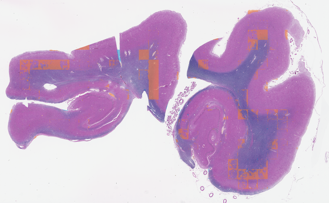

# Tile-Level Artifacts (`artifacts.py`, `artifacts_tile.py`)

[Package overview](../../README.md) · [CLI usage](../../../USAGE_CLI.md) · [Library usage](../../../USAGE_LIBRARY.md) · [Parent module](../README.md)

[What it does](#what-it-does) · [How it works](#how-it-works) · [Usage](#usage) · [Defaults](#defaults) · [Historical observations and limitations](#historical-observations-and-limitations) · [References](#references)

For setup, paths, and output folders, start with the [usage guide](../../../USAGE_CLI.md). Command examples below use the activated environment where the package is installed. Replace `/path/to/slide.svs` with your slide and mask paths with files from its earlier run.

Resolutions shown are the shipped defaults; µm/px means micrometres per pixel. Output artifacts are written inside the slide’s timestamped run folder unless `--no_save_artifacts` is used; the report is still written.

> **Requires a GrandQC checkout and model weights.** The full run and `--run_tiles` request this
> stage automatically unless `components.tile_artifacts=false` excludes it in config. When selected,
> missing default assets are installed automatically. Invalid custom paths, failed setup, or missing
> assets with downloads disabled cause a preflight error. Predictions are unvalidated on this data; review the limitations below.

Managed setup packages a standalone compatibility bridge and patches the pinned GrandQC scripts.
See [model setup](../../external/README.md) for automatic downloads or registering your own compatible
checkout. User checkouts are not patched. `--grandqc_python` selects a separate backend environment.

## What it does

Labels each tile with the artifacts it contains, using the GrandQC segmentation model — **one way**
(2026-09-09): GrandQC runs over the **whole slide** through its own scripts, at the requested model resolution when its checkpoint exists, otherwise the finest
available supported resolution, and produces one per-pixel class mask; each tile's fractions and pen polygons
are cut from that mask.

- **In:** the localized slide file, the tile list and the tile plane; the GrandQC checkout.
- **Out:** per-tile artifact fractions, pen polygons, a `has_artifact` flag; a slide summary at
  `m3.artifacts`; the class-map overlay.
- **Model classes:** `tissue · fold · darkspot · pen · bubble · oof · background` (1–7).
- **Consumed by the pipeline:** fold, pen, bubble (`m3.artifacts.classes`).
- **Artifact tiles are flagged, never dropped.**

| function | file | what it does |
|---|---|---|
| `run_grandqc_full_mask` | `artifacts_tile.py` | the expensive part: `wsi_tis_detect.py` then `main.py` as subprocesses; returns the class mask at the model MPP |
| `resolve_model_mpp` | `artifacts_tile.py` | the requested model MPP, or the finest checkpoint the checkout has (1.0 → 1.5 → 2.0) |
| `compute_tile_artifacts` | `artifacts_tile.py` | one tile's per-class fractions, background fraction and pen polygons, from the mask |
| `detect_slide_artifacts` | `artifacts.py` | the entry point: checkout → GrandQC once → every tile |
| `artifact_tile_metrics` | `artifacts.py` | the per-tile loop + `min_fraction` flagging; checks the mask is at the recorded scale |
| `check_grandqc_repo` · `resolve_repo` | `artifacts.py` | pre-flight validation of the checkout; flag over config |
| `generate_artifact_overlay` · `merge_tile_artifacts` · `to_report` | `artifacts.py` | wiring |

## How it works

- **Why the whole slide, once.** GrandQC's artifact model exists only at 5×/7×/10× (MPP 2.0/1.5/1.0)
  — there is no 20× model — and its patch covers about 1 mm, roughly sixteen tiles. So inference is a
  sliding window over the slide at the model's native resolution, not a per-tile pass and not a
  thumbnail pass, and the per-tile numbers are read off the resulting mask.
- **Through GrandQC's own scripts.** `wsi_tis_detect.py` (its tissue model) then `main.py` (the
  artifact model), each a subprocess with a timeout, carrying the compatibility patches
  `pathnd-qc setup grandqc` applies to its managed checkout. Nothing here loads the checkpoint in-process any more: the in-process
  backend read the slide's nearest pyramid level instead of resampling level 0, which measurably
  inflated the texture-dependent classes (bubble 12.8 % vs 6.4 % on the same slide), and two
  backends that were not equivalent were one too many.
- **The frame.** Tiles live on the 0.50 µm/px tile plane (`tiles.py`); the mask is at the model MPP.
  `compute_tile_artifacts` maps between them by the MPP ratio, and the mask's size is checked against
  the plane first — a mask GrandQC produced at a different scale is a recorded error, never a silent
  misplacement.
- **Choosing classes changes the output, not the cost.** One mask; every class is in it. Selecting several classes in one call shares that inference. Separate pipeline runs perform
  inference again; there is no cross-run class-mask cache here.
- **`min_fraction`** (`null` by default) sets `has_artifact` / `artifact_label`. There is no calibrated
  threshold configured, so the default records fractions without threshold-based flags.

## Usage

Pipeline runs automatically install missing default GrandQC assets. Use `--no_model_download`
to require an existing installation. Direct component calls need a usable checkout path.

```bash
pathnd-qc --slide "/path/to/slide.svs" --run_tile_artifacts \
    --tissue_mask "/path/to/previous_run/slide_tissue_mask.png" \
    --tile_list "/path/to/previous_run/slide_tile_list.json"
```

To use a custom checkout, add `--grandqc_repo /absolute/path/to/01_WSI_inference_OPENSLIDE_QC`.

The Python example is a contextual snippet: create an RGB PIL image named `plane` (or `thumb`)
and the masks/geometry it references first. Check returned error fields before using results.

```python
from pathnd_qc.qc_tile.artifacts.artifacts import detect_slide_artifacts, generate_artifact_overlay
res = detect_slide_artifacts(local_slide_path, tiles, plane_dims, grandqc_repo=repo)   # GrandQC once
res["tiles"][0]["artifact_fractions"]                                                # per tile
generate_artifact_overlay(thumb, res["artifact_map"]).save("overlay.png")
```

- **Flag:** `--run_tile_artifacts`. Also runs inside the `--run_tiles` M3 alias, and is in the
  default set.
- **Needs a tissue mask and a tile list.** It uses tile **geometry**, not `tile_metrics` output, so the
  two M3 components are independent and run in either order.
- **Needs the checkout, and a local file.** `--grandqc_repo` must be the inference directory
  (`.../01_WSI_inference_OPENSLIDE_QC` with `wsi_tis_detect.py`, `main.py` and `models/qc/*.pth`);
  the tissue checkpoint under `models/td/` is also required. Pipeline runs obtain missing defaults;
  invalid custom paths or missing assets with downloads disabled fail preflight.
  Inference failures make the run fail with a report. The slide is localized for this analysis.
- **`m3.artifacts.repo_path`** is used when no flag is given; an invalid custom checkout is an error.
  The report's `provenance.grandqc_repo` records the path and its source: flag, config, or managed setup.
- **Writes `images/<slide_id>_artifact_overlay.png`** — the class map over the analysis image, tinting only
  the classes in `m3.artifacts.classes`; tissue and background are the backdrop.
- **Returns** `{tiles: [{col, row, x, y, w, h, artifact_fractions, background_fraction, has_artifact,
  artifact_label, pen_polygons}], classes, n_flagged, n_flagged_by_class, min_fraction, mask_dims,
  artifact_map, backend, model_mpp, requested_mpp, runtime_s, artifact_error}`. Pen polygons are in
  tile-plane pixels.

### What the CLI saves

The CLI saves the aggregate `m3.artifacts` report and an overlay when available. It does **not**
save the per-tile artifact fractions or pen polygons in `data/<slide_id>_tile_records.json`; that file
contains tile-metrics results. `merge_tile_artifacts` exists as a helper but is not called by the
pipeline. Python callers can retain `run(...)['artifacts']['tiles']` and explicitly serialize the
per-tile values. Standalone `detect_slide_artifacts(...)` returns them under `tiles`.

The backend subprocess deadlines are 900 seconds for tissue detection and 3,600 seconds for
artifact detection. A batch slide has an independent 3,600-second default deadline covering the
entire run; increase `--timeout_s` when measurements show it is needed.

## Defaults

| key | default | what it does |
|---|---|---|
| `m3.artifacts.model_mpp` | `1.0` | use the requested checkpoint when present; otherwise try 1.0, 1.5, then 2.0 |
| `m3.artifacts.classes` | `["fold","pen","bubble"]` | the classes reported and flagged per tile |
| `m3.artifacts.min_fraction` | `null` | area fraction at or above which a class flags a tile; `null` records only |
| `m3.artifacts.repo_path` | `external/grandqc/repo/01_WSI_inference_OPENSLIDE_QC` | the checkout used when `--grandqc_repo` is not given and it exists |
| `m3.artifacts.device` | `"cpu"` | passed to GrandQC's `main.py --device`; the patched tissue script uses CPU |
| `m3.artifacts.python` | `null` | backend Python executable; `--grandqc_python` overrides it |

The table shows the literal shipped fallback; registered model paths override it.
See [model locations](../../external/README.md#model-locations) for relative paths and managed downloads.

## Historical observations and limitations

The examples and measurements in this section come from earlier development runs. They have not
been rerun for this documentation update and may use older code or image resolutions. They are not
current benchmarks, accuracy guarantees, or recommended quality thresholds.

**Measured on two slides, fractions over the whole class map:**

| slide | stain | fold | pen | bubble |
|---|---|---|---|---|
| `42669` | LFB/H&E — 4 confirmed folds | **0.55 %** | 3.89 % | 14.91 % |
| `H21.33.008-A12-LFB` | LFB | **0.01 %** | 0.08 % | 3.34 % |

| | slide | artifact map |
|---|---|---|
| **`H21.33.008-A12-LFB`** |  |  |

Image credit: Allen Institute, SEA-AD — https://registry.opendata.aws/allen-sea-ad-atlas/; see
[third-party notices](../../../THIRD_PARTY_NOTICES.md).

- ⚠️ **Trained on cancer histology; performs badly on neuropathology.**
  - On `42669`, which has **four confirmed folds**, it marks **none of them**.
  - It paints whole 512 px patches instead — a chequerboard with no anatomical
    correspondence.
  - Predictions are quantised to the inference grid: each patch is an independent forward pass, so
    neighbouring patches near a decision boundary flip whole. This persists in GrandQC's own pipeline.
- **Cost: 5–8 minutes per slide** — `42669` **332 s** · `H21.33.008-A12-LFB` **440 s** at MPP 2.0. The
  default now requests MPP 1.0, which reads four times the pixels; measure before assuming.
- **No tear class.** The model emits fold, pen, bubble, darkspot, out-of-focus, tissue and background
  only.

## References

- Weng et al., "GrandQC: A comprehensive solution to quality control problem in digital pathology,"
  *Nat Commun* 2024 (`s41467-024-54769-y`) —
  [github.com/cpath-ukk/grandqc](https://github.com/cpath-ukk/grandqc).
- Model downloads, registration and compatibility patches: [model installer](../../external/README.md).
- License: GrandQC is distributed under a non-commercial license (code and artifact checkpoints
  CC BY-NC-SA 4.0; tissue checkpoint CC BY-NC 4.0), and use is subject to the terms of the original
  GrandQC license. See [third-party notices](../../../THIRD_PARTY_NOTICES.md).
