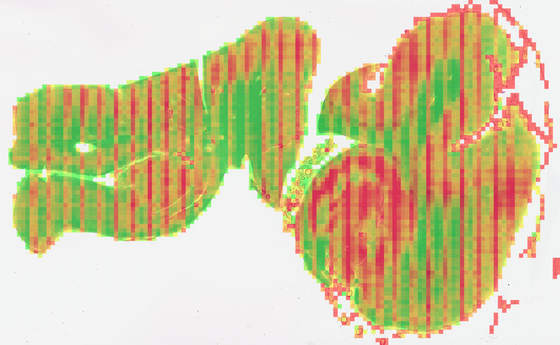

# Per-Tile Metrics (`tile_metrics.py`)

[Package overview](../../README.md) · [CLI usage](../../../USAGE_CLI.md) · [Library usage](../../../USAGE_LIBRARY.md) · [Parent module](../README.md)

[What it does](#what-it-does) · [How it works](#how-it-works) · [Usage](#usage) · [Defaults](#defaults) · [Historical observations and limitations](#historical-observations-and-limitations) · [References](#references)

For setup, paths, and output folders, start with the [usage guide](../../../USAGE_CLI.md). Command examples below use the activated environment where the package is installed. Replace `/path/to/slide.svs` with your slide and mask paths with files from its earlier run.

Resolutions shown are the shipped defaults; µm/px means micrometres per pixel. Output artifacts are written inside the slide’s timestamped run folder unless `--no_save_artifacts` is used; the report is still written.

## What it does

Reads every selected tile at the configured tile resolution, measures how much tissue it really contains and how
sharp it is, and drops the tiles that are mostly glass.

**In:** a reader, a slide, the tissue mask and a tile list.
**Out:** per-tile records, a slide summary, a full-resolution tissue mask, and a focus heatmap.

Reading and measuring tiles can be the slowest part of a run. Remote slides need a local copy;
local slides are opened directly. Runtime and disk requirements depend on slide size.

| function | what it does |
|---|---|
| `compute_tile_metrics` | the main pass: per-tile tissue fraction, focus, and the two-pass drop |
| `generate_blur_overlay` | the per-tile focus heatmap |
| `refine_tissue_mask` | an optional chunk-level refinement pass the pipeline does not use |

## How it works

Each tile goes through two passes:

- **Pass 1, before reading.** If the coarse mask says the tile is under 20 % tissue, drop it — a
  hopeless tile costs no full-resolution read at all.
- **Pass 2, after reading.** Survivors that aren't already fully tissue are re-segmented at full
  resolution; if the refined fraction is still under 20 %, drop the tile.

Focus is then measured over the tile's tissue support, reusing
[`focus`](../../qc_slide/focus/README.md).

- **Support comes from the mask, not a fresh threshold on the tile.** Thresholding needs both tissue
  and glass present; on an all-tissue tile there is no glass to threshold against, so an automatic
  threshold splits *within* the tissue and reports about 50 % instead of 100 %.
- **Tile support is handed to an optional packed-memory writer as the loop runs.** Its one-bit
  plane uses one eighth of the memory of a full boolean plane. The packed allocation is refused
  before it exceeds `m3.tile_metrics.max_mask_bytes` (512 MiB by default); this is not a bound on
  the entire process's memory.
- **`refine_tissue_mask` is built and callable, but unused.** It refines the mask in chunks at
  2.0 µm/px between the coarse mask and the tile. `pipeline.run()` selects tiles straight from the M2 mask and
  refines per tile instead, so `m3.cascade` in the report is always an explicit skip.

## Usage

```bash
pathnd-qc --slide "/path/to/slide.svs" --run_tissue_segmentation --run_tile_selection --run_tile_metrics
pathnd-qc --slide "/path/to/slide.svs" --run_tile_metrics \
              --tissue_mask out/m.png --tile_list out/slide_tile_list.json
```

The Python example is a contextual snippet: create an RGB PIL image named `plane` (or `thumb`)
and the masks/geometry it references first. This example also requires a configured reader,
slide path, and matching tile-plane dimensions. Check returned error fields before using results.

```python
from pathnd_qc.qc_tile.tile_metrics.tile_metrics import compute_tile_metrics, generate_blur_overlay

with reader.localize(path) as local:
    with reader.slide(local) as s:
        res = compute_tile_metrics(reader, s, tissue_mask, tiles, plane_dims,
                                   stain_type="LFB/H&E", drop_below=0.20)
overlay = generate_blur_overlay(thumb, res, plane_dims)
```

- **Flag:** `--run_tile_metrics`. Also runs inside the `--run_tiles` M3 alias.
- **Needs a tissue mask and a tile list** — compute them or supply them with `--tissue_mask` and
  `--tile_list`.
- **Remote slides are localized before tile reads.** Local slides need no download.
- **`drop_below=None`** disables tissue-fraction dropping; unreadable tiles still have `kept=False`.
- **The pipeline normally writes three files (the direct function only writes mask tiles when a
  `mask_writer` is provided):** `data/<slide_id>_tile_records.json` (every per-tile record — thousands per slide,
  which is why they are not in the report), `images/<slide_id>_tissue_mask_20x.tif` (the full-resolution mask,
  tiled 1-bit LZW with a pyramid) and `images/<slide_id>_blur_overlay.png`. The records are an output,
  not a supplyable input — `--tile_metrics_json` was removed 2026-09-07 because nothing consumed it.
- **Each tile record holds** `{col, row, x, y, w, h, tissue_overlap, tissue_fraction,
  tissue_fraction_coarse, focus, resegmented, reseg_error, read_error, focus_error, dropped_pass1, dropped_pass2,
  kept, mask_written, mask_write_error}`.
- **Read failures are retained in the records:** `read_error` explains the failure, `focus` is null,
  and `kept` is false. The loop continues and `n_read_failed` reports the count. Failed edge
  re-segmentation records `reseg_error` and uses the coarse support; inspect these fields before
  interpreting summaries.
- **An optional mask-writer failure does not discard measurements.** The loop stops inserting
  mask pixels, continues measuring later tiles, and returns `mask_write_error` plus
  `mask_complete=false`. The pipeline records the output failure and does not publish that mask.
  Direct callers must also check these fields before calling their writer's `write()` method.
  `mask_complete=null` means no writer was requested.

### What the saved mask and focus summary include

The fine tissue mask receives pixels after tile reading/resegmentation, before the second
tissue-fraction drop. It can include tissue in a tile whose `kept` value is false because of
`dropped_pass2`. Tiles dropped in pass 1, unselected regions and read failures leave zeros.
`mask_complete=true` means the requested mask writer completed, not that every slide region was
decoded or that the mask contains only kept tiles.

Focus aggregates and overlays use all non-null measured focus values, including pass-2 drops.
The low-focus outlier group uses kept tiles; dropped and error groups are collected separately.
Overlay colors are scaled to each run's 5th–95th percentiles, so colors cannot be compared
quantitatively across slides. Fewer than two measurements, or a flat range, leaves it untinted.

## Defaults

Values live in [`config/defaults.json`](../../config/defaults.json). Prefer a separate JSON override file selected with
`PATHND_CONFIG=/path/to/settings.json`; see the [configuration guide](../../config/README.md).
Where a Python function accepts an argument, an explicit value overrides its configured default.
Configuration keys are not automatically command-line flags.

| key | default | what it does |
|---|---|---|
| `m3.read.tile_target_mpp` | `0.5` | the resolution tiles are read at |
| `m3.read.chunk_target_mpp` | `2.0` | resolution used by `refine_tissue_mask` |
| `m3.read.halo_out_px` | `4` | pixels read beyond a window's edge, to avoid resampling seams |
| `m3.tile_metrics.progress_every_s` | `30.0` | interval for tile-loop progress logging |
| `m3.tile_metrics.drop_below` | `0.2` | tissue fraction below which a tile is dropped, both passes |
| `m3.tile_metrics.chunk_reseg_min` | `0.1` | lower coverage bound for chunk re-segmentation |
| `m3.tile_metrics.resegment_edges` | `true` | whether partly-covered tiles are re-segmented |
| `m3.tile_metrics.max_mask_bytes` | `536870912` | packed-mask allocation budget in bytes (512 MiB) |
| `m3.tile_metrics.alpha_blend` | `0.5` | heatmap opacity |
| `report.focus_outlier_n` | `20` | limit per selected outlier group; read/resegmentation errors are uncapped |

`thresholds.m3.tiles.focus_median` and `.kept_fraction` hold the slide-level bounds. Both ship `null`.

## Historical observations and limitations

The examples and measurements in this section come from earlier development runs. They have not
been rerun for this documentation update and may use older code or image resolutions. They are not
current benchmarks, accuracy guarantees, or recommended quality thresholds.

**Two slides run end to end**, both LFB but from different banks and scanners:

| | `42669` — PART | `H21.33.008-A12-LFB` — SEA-AD |
|---|---|---|
| level-0 resolution | 0.5066 µm/px | 0.5016 µm/px |
| tissue coverage | 0.637 | 0.528 |
| tiles selected | 3,825 | 6,331 |
| dropped before reading | 143 | 292 |
| dropped after reading | 76 | 211 |
| **kept** | **3,606 — 94.3 %** | **5,828 — 92.1 %** |
| re-segmented at the configured tile resolution | 489 (12.8 %) | 967 (15.3 %) |
| read failures | **0** | **0** |
| focus, p5 · median · p95 | 114 · **499** · 1,036 | 1,231 · **2,003** · 2,741 |
| 20× tissue mask | 1.45 Gpx → **3.76 MB** (386×) | 2.84 Gpx → **8.53 MB** (333×) |
| total runtime | 410 s | 603 s |

**Two things to take from that pair.** The keep rate and the re-segmentation rate are stable across
banks — 94 % and 92 %, 13 % and 15 % — so the two-pass drop behaves consistently. But the **focus
medians differ fourfold on the same stain**, 499 against 2,003, which is why focus values are not
comparable between slides and the blur overlay must be read within one slide only.

**Where the time goes:**

| step | `42669` | `H21.33.008-A12-LFB` |
|---|---|---|
| reading and measuring tiles | **375.8 s** | **530.4 s** |
| downloading the slide | 14.4 s | 50.8 s |
| writing the 20× mask | 9.7 s | 7.1 s |
| the M2 tissue mask it consumes | 6.1 s | 10.4 s |
| selecting the tiles | 0.06 s | 0.11 s |

M3 is **94 %** and **89 %** of those two runs, and the tile loop is nearly all of it. (42669's download
is fast only because that slide was already cached locally.)

**Across the full 171-slide set** it completes on every slide: **900,873 tiles** measured, 325 to
13,347 per slide (median 5,204), 7–63 % re-segmented (median 15 %), 1.2 to 42.9 minutes per slide
(median 8.5).

**The two-pass drop behaves as designed.** On 23 hand-picked tiles: 3 dropped before reading, 3 after,
17 kept. One tile migrated exactly as predicted — it inherited 0.275 coverage from the coarse mask,
survived pass 1, re-segmented to 0.040, and pass 2 dropped it.

**The blur overlay, from the SEA-AD run:**

| | slide | focus heatmap |
|---|---|---|
| **`H21.33.008-A12-LFB`** — SEA-AD |  |  |

Image credit: Allen Institute, SEA-AD — https://registry.opendata.aws/allen-sea-ad-atlas/; see
[third-party notices](../../../THIRD_PARTY_NOTICES.md).

On the PART LFB/H&E run, red marked low-texture regions rather than defocus. On the SEA-AD slide,
the **dead-straight vertical stripes** ignore the anatomy. Both are the caveats below.

### What to be careful with

- ⚠️ **The blur overlay is a texture map, not a blur map.** Laplacian variance depends on content, so
  red means *"blurry or low-texture"*, and values are **not comparable between slides** — across the
  171 slides the per-slide median focus spans **12 to 4,381, a 353× range**. On a pale slide the red
  regions are low-cellularity white matter, not defocus. On well-stained H&E it does separate global
  from regional defocus, and recovers what a slide-level average hides.
- ⚠️ **Every SEA-AD blur map shows vertical stripes** that ignore anatomy, where the PART control is
  smooth. Probably a scanner artefact the per-tile measurement surfaces — which would be a legitimate
  QC signal — but **not confirmed**.
- ⚠️ **A tile the mask reads as exactly 100 % tissue is not re-segmented and is not dropped by the default tissue-fraction rule**, so
  glass hidden inside it survives. Forcing re-segmentation on one such tile got it right at 0.984, so
  the trigger is the defect.
- ⚠️ **Pale IHC fails in both directions at the configured tile resolution** — one tile re-segments down from 0.39 to
  0.02, another *up* to 0.997 despite visible white space. So a fraction near 1.0 cannot be trusted on
  pale stains, which is exactly what the previous point assumes.
- **A contributing limitation in those earlier examples:** the re-segmenter is M2's `compute_tissue_mask` unchanged, and its
  cleanup sizes are calibrated for a 16× coarser image.

**`refine_tissue_mask` is a separate Python API, not a pipeline stage.** It returns a finer mask
that callers can choose to pass into selection or metrics. That can change later support, selection,
and dropping decisions; no improvement is guaranteed.

## References

- Focus metric: [`qc_slide/focus/`](../../qc_slide/focus/README.md).
- Tile geometry: [`tiles/`](../tiles/README.md).
