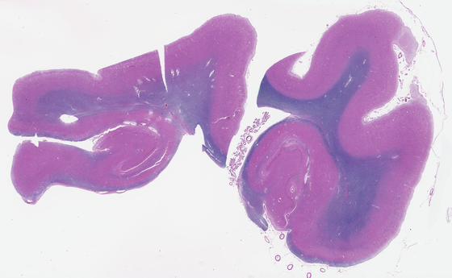
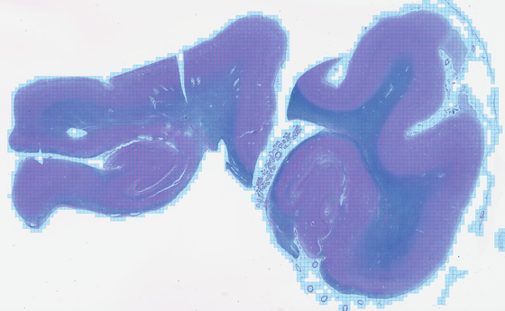

# Tile Geometry (`tiles.py`)

[Package overview](../../README.md) · [CLI usage](../../../USAGE_CLI.md) · [Library usage](../../../USAGE_LIBRARY.md) · [Parent module](../README.md)

[What it does](#what-it-does) · [How it works](#how-it-works) · [Usage](#usage) · [Defaults](#defaults) · [Historical observations and limitations](#historical-observations-and-limitations)

For setup, paths, and output folders, start with the [usage guide](../../../USAGE_CLI.md). Command examples below use the activated environment where the package is installed. Replace `/path/to/slide.svs` with your slide and mask paths with files from its earlier run.

Resolutions shown are the shipped defaults; µm/px means micrometres per pixel. Output artifacts are written inside the slide’s timestamped run folder unless `--no_save_artifacts` is used; the report is still written.

## What it does

Cuts the slide into a tile grid and picks out the tiles that contain tissue.

**In:** the plane dimensions and the tissue mask.
**Out:** a list of tile records, each with its position and how much tissue it overlaps.

**The geometry functions read no pixels.** They operate on supplied dimensions and a mask.
The pipeline still opens the slide to obtain dimensions and resolution; a remote header read may
use the network. Tile *pixels* are read later by
[`tile_metrics`](../tile_metrics/README.md).

| function | what it does |
|---|---|
| `tile_grid` | a non-overlapping 512×512 grid over the plane, edge tiles clipped |
| `select_tissue_tiles` | the subset touching tissue, each with a `tissue_overlap` value |
| `plane_window` | a tile's window on any whole-slide plane |
| `window_origin` | shifts a clipped edge window back to full size |

## How it works

**Tiles are 512×512 cells on a plane at a fixed 0.50 µm/px** — not on the slide's own finest level.
That plane is conceptual: its memory size depends on slide dimensions, and tile pixels are read
on demand.

- `plane_dims` is `(width, height)`; a tile's `x, y, w, h` are **plane** pixels. Only the reader
  converts them to slide coordinates.
- **The tissue mask can come from any plane** — the scale is derived from its shape, so a thumbnail
  mask and a finer mask both work with no change in arguments.
- **A tile record has no `level` field.** It would be meaningless here: the pyramid level is chosen by
  the reader at read time, not fixed when the tile is selected.
- **Selection has no minimum overlap.** Every tile touching tissue is selected; keeping or dropping is
  [`tile_metrics`](../tile_metrics/README.md)'s job, which can see the tile's actual pixels.

## Usage

```bash
pathnd-qc --slide "/path/to/slide.svs" --run_tissue_segmentation --run_tile_selection
pathnd-qc --slide "/path/to/slide.svs" --run_tile_selection \
              --tissue_mask out/slide_tissue_mask.png            # reuse an earlier mask
```

The Python example is a contextual snippet: create an RGB PIL image named `plane` (or `thumb`)
and the masks/geometry it references first. Check returned error fields before using results.

```python
from pathnd_qc.qc_tile.tiles.tiles import tile_grid, select_tissue_tiles

grid  = tile_grid(plane_dims)                          # every cell
tiles = select_tissue_tiles(tissue_mask, plane_dims)   # the tissue-bearing subset
# -> [{"col", "row", "x", "y", "w", "h", "tissue_overlap"}, ...]
```

- **Flag:** `--run_tile_selection`. Also runs inside the `--run_tiles` M3 alias.
- **The CLI needs a tissue mask and a readable slide header.** The Python function instead takes
  `plane_dims` explicitly. If tissue segmentation is also selected, the analysis image must be read.
- **Writes:** `data/<slide_id>_tile_list.json` as `{"plane_mpp": 0.5, "plane_dims": [w, h], "tiles": [...]}`
  — the list declares the plane it was selected on (2026-09-08). Supply it back with
  `--tile_list <path>`: the pipeline skips the affected M3 work when the declared plane differs or tile windows fall
  outside it. These checks validate geometry, not slide identity: a same-sized wrong-slide list
  cannot be detected from dimensions alone. A bare
  JSON array is still accepted, with only the geometric check. Coordinates must be integers;
  duplicate tiles are dropped once with a warning; `col`/`row` are optional.
- See the [main usage guide](../../../USAGE_CLI.md) to run the pipeline; the Python snippet here is for
  callers that already have a correctly scaled mask and dimensions.

## Defaults

Values live in [`config/defaults.json`](../../config/defaults.json). Prefer a separate JSON override file selected with
`PATHND_CONFIG=/path/to/settings.json`; see the [configuration guide](../../config/README.md).
Where a Python function accepts an argument, an explicit value overrides its configured default.
Configuration keys are not automatically command-line flags.

| key | default | what it does |
|---|---|---|
| `shared.tile_px` | `512` | tile size in plane pixels — 512 at 0.50 µm/px is 256 µm |
| `m3.read.tile_target_mpp` | `0.5` | the resolution the plane is defined at |

`m3.tiles.tile_px` is checked first and falls back to `shared.tile_px`. It is **not present in
`defaults.json`** — add it to your override JSON for a tile size specific to M3.

## Historical observations and limitations

The examples and measurements in this section come from earlier development runs. They have not
been rerun for this documentation update and may use older code or image resolutions. They are not
current benchmarks, accuracy guarantees, or recommended quality thresholds.

**Geometry selection was inexpensive in earlier measurements.** On two slides: **3,825 tiles selected in 0.06 s** and **6,331 in
0.11 s**, against 376 s and 530 s for the component that then reads those tiles. It touches no pixels,
so the whole thing is arithmetic on the mask.

Across the 171-slide set it produced **900,873 tiles in total** — 325 to 13,347 per slide, median
5,204.

**Selected tiles over the slide**, from the SEA-AD run:

| | slide | tissue mask it selects from | selected tiles |
|---|---|---|---|
| **`H21.33.008-A12-LFB`** — 6,331 tiles |  |  |  |

Image credit: Allen Institute, SEA-AD — https://registry.opendata.aws/allen-sea-ad-atlas/; see
[third-party notices](../../../THIRD_PARTY_NOTICES.md).

- **The grid traces the tissue and stops at the glass.**
  - Checked visually across five slides and several stains — no axis swap, glass and dust excluded.
  - **51 % to 66 %** of the grid is selected, depending on stain.
  - On a pale AT8 slide it correctly drops a tissue tear and the glass between lobes.
  - The staircase edge is the tile granularity, inherited from selecting on a coarse mask.

- **The fixed 0.50 µm/px frame is what keeps slides comparable.**
  - The slide's own finest level is 20× on PART and SEA-AD but **40× on QSBB**, so cutting there
    would make one "512 px tile" mean **256 µm on most slides and 118 µm on 34 of them**.
  - Measured, the frame holds: a SEA-AD slide grids to 98 × 82 = **8,036** tiles, a QSBB slide to
    118 × 90 = **10,620** — not the 4.7× more the finer scanner would otherwise produce for the same
    tissue.

- **Selection is deliberately coarse**, to avoid reading every tile for selection.
  - A tile the mask reads as fully tissue is selected even if it holds glass too small for the mask
    to see.
  - That case is handled, and partly missed, by [`tile_metrics`](../tile_metrics/README.md).
